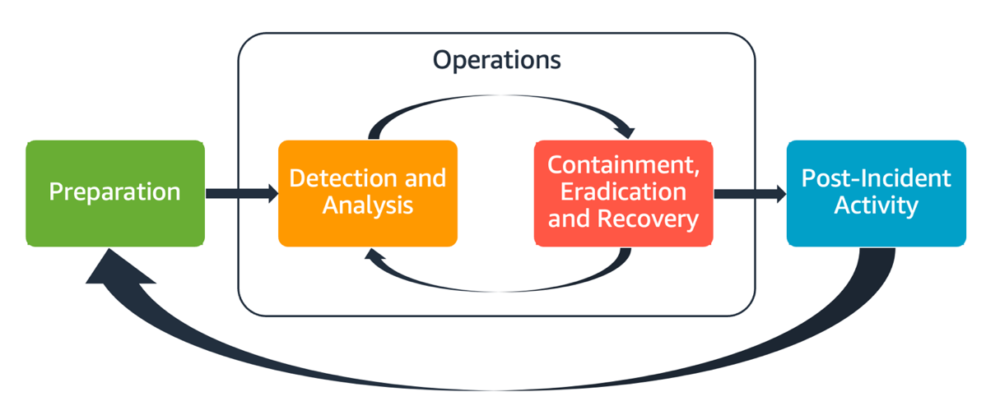

# Domain 1	- Threat Detection and Incident Response (14%)

## Exam Objectives 

| Task Statement | Exam Objective     | 
| ------------------------ | ------------------ | 
| **Domain 1** | **Threat Detection and Incident Response (14%)**
| 1 | [Design and implement an incident response plan](#task-statement-1-design-and-implement-an-incident-response-plan)
| 2 | [Detect security threats and anomalies by using AWS services](#task-statement-2-detect-security-threats-and-anomalies-by-using-aws-services)
| 3 | [Respond to compromised resources and workloads](#task-statement-3-respond-to-compromised-resources-and-workloads)

## Task Statement 1.1: Design and implement an incident response plan

Knowledge of:
- **AWS best practices for incident response**
  <!-- -  -->
  - Combine available controls, cloud capabilities and remediation options
  - Start small and iterate as you adopt automation capabilities
  - See [AWS Security Incident Response Guide](https://docs.aws.amazon.com/whitepapers/latest/aws-security-incident-response-guide/aws-security-incident-response-guide.html)
- **Cloud incidents**
- **Roles and responsibilities in the incident response plan**
- **[AWS Security Finding Format (ASFF)](https://docs.aws.amazon.com/securityhub/latest/userguide/securityhub-findings-format.html)**

Skills in:
- Implementing credential invalidation and rotation strategies in response to compromises (for example, by using AWS Identity and Access Management [IAM] and [AWS Secrets Manager](../../services/secretsmgr/README.md))
- Isolating AWS resources
- Designing and implementing playbooks and runbooks for responses to security incidents
- Deploying security services (for example, [AWS Security Hub](../../services/securityhub/README.md), [Amazon Macie](../../services/macie/README.md), [Amazon GuardDuty](../../services/guardduty/README.md), Amazon Inspector, [AWS Config](../../services/config/README.md), Amazon Detective, [AWS Identity and Access Management Access Analyzer](../../services/iamanalyzer/README.md))
- Configuring integrations with native AWS services and third-party services (for example, by using [Amazon EventBridge](../../services/eventbridge/README.md) and the [ASFF](https://docs.aws.amazon.com/securityhub/latest/userguide/securityhub-findings-format.html))

## Task Statement 1.2: Detect security threats and anomalies by using AWS services. 

Knowledge of:
- **AWS managed security services that detect threats**
- **Anomaly and correlation techniques to join data across services**
- **Visualizations to identify anomalies**
- **Strategies to centralize security findings**

Skills in:
- Evaluating findings from security services (for example, [Amazon GuardDuty](../../services/guardduty/README.md), [Security Hub](../../services/securityhub/README.md), [Macie](../../services/macie/README.md), [AWS Config](../../services/config/README.md), [IAM Access Analyzer](../../services/iamanalyzer/README.md))
- Searching and correlating security threats across AWS services (for example, by using Detective)
- Performing queries to validate security events (for example, by using Amazon Athena)
- Creating metric filters and dashboards to detect anomalous activity (for example, by using
Amazon CloudWatch)  

## Task Statement 1.3: Respond to compromised resources and workloads. 

Knowledge of:
- **AWS Security Incident Response Guide**
  - See [AWS Security Incident Response Guide](https://docs.aws.amazon.com/whitepapers/latest/aws-security-incident-response-guide/aws-security-incident-response-guide.html)
  - [Aspects of AWS incident response](../../../images/D1T1.png)
- **Resource isolation mechanisms**
- **Techniques for root cause analysis**
- **Data capture mechanisms**
- **Log analysis for event validation**

Skills in:
- Automating remediation by using AWS services (for example, AWS Lambda, AWS Step Functions, [EventBridge](../../services/eventbridge/README.md), AWS Systems Manager runbooks, [Security Hub](../../services/securityhub/README.md), [AWS Config](../../services/config/README.md))
- Responding to compromised resources (for example, by isolating Amazon EC2 instances)
- Investigating and analyzing to conduct root cause analysis (for example, by using Detective)
- Capturing relevant forensics data from a compromised resource (for example, Amazon Elastic
Block Store [Amazon EBS] volume snapshots, memory dump)
- Querying logs in Amazon S3 for contextual information related to security events (for
example, by using Athena)
- Protecting and preserving forensic artifacts (for example, by using S3 Object Lock, isolated
forensic accounts, S3 Lifecycle, and S3 replication)
- Preparing services for incidents and recovering services after incidents

---
