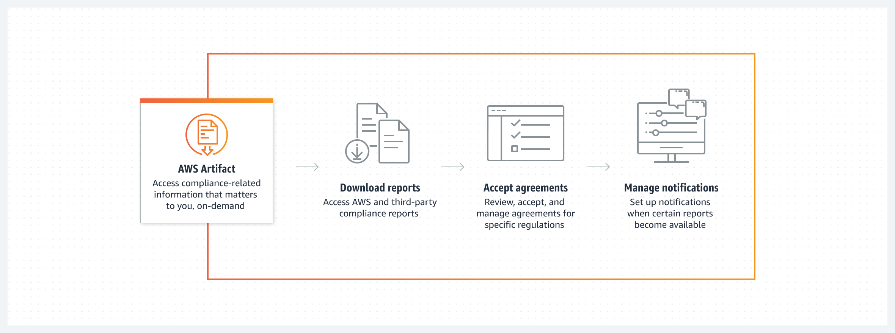

#   AWS Artifact  

---  

## Overview  
- Compliance reports
- Centralized resource
- On-demand downloads of AWS security and compliance documents
  - ISO, PCI, SOC... 
- Guidelines provided

---  
## Compliance Reports
- On-Demand
- Downloadable
- Unique to your Acct | OU
- Do not share reports to 3rd party !
- T&C before downloading

---
## Agreement 
- Accept & manage agreements (such as BAA - Business Associate Addendum)
- Single AWS account or entire OU (all accounts covered)
- States:
  - Active: accepted by user
  - Inactive: not accepted by user or terminated by user

---  
## Exam Tips
- on-demand
- for audits
- **AWS only** (not on-prem) <-- important
- Your responsibility
- Review & accept (business associate)
- Designat AWS accounts
- Agreements for a singe AWS account ou whole OU

---  
## AWS Resources

Features  
https://aws.amazon.com/artifact/

Documentation  
https://docs.aws.amazon.com/artifact/

FAQ
https://aws.amazon.com/artifact/faq/

---  

