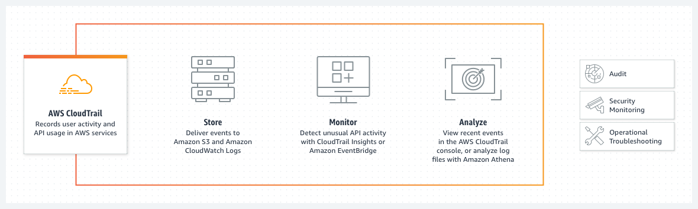

#   AWS CloudTrail

---  

---  
- ***records ANY action*** taken by users, roles or services via Console, AWS CLI and AWS SDK/APIs.
- enabled by default with every account
- events stored for 90 days by default
- multi-region support
  - same trail in **every** region (included new regions) 
- long-term storage with S3

## Usage
- Auditing
- Governance
- Compliance
- Managment
  

## Exam Tips
- Auditing activities --> CloudTrail !
- Single and Multi Region
- KMS for customized encryption
- Log validation
- Management vs Data Events  
- Integration with EventBridge
  

## Encryption
- by default S3 Server-Side Encryption (SSE) 
- KMS support for compliance
- SNS integration
  - **SNS notifications for log file deliveries to S3 and validation of the delivered files** (exam topic!) e.g. sending to SecOps teams
  

## Management vs Data Events  
[Control Plane vs Data Plane]  

### Management Events 
[Control Plane]  

- logged by default
- all API calls
- ConsoleLogin

### Data Events
[Data Plane]  

- not logged by default
- huge amount of logs
  
## Limitations
- **up to 5 trails per region**
- first trail free, next are not (watch out usage & cost)
- Global services typically log as occuring in `us-east-1`

## Events
- Trigger alarms
- Trigger EvenBridge
- send notifications

---  

### Scenario  

---  

## AWS Resources

Features  
https://aws.amazon.com/cloudtrail/

Documentation  
https://docs.aws.amazon.com/cloudtrail/
