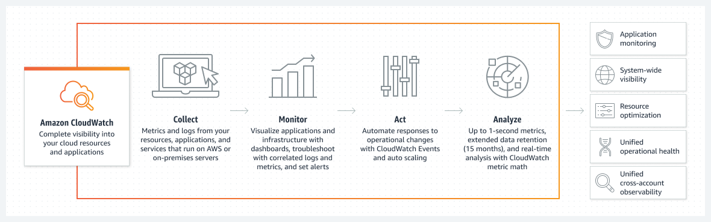

#   Amazon CloudWatch  

---  

---  
- **Logging and Monitoring**
  - within AWS and external (can send to CloudWatch)
- **Centralized and Secured**
  - KMS encryption
- **Easy Analysis**
  - Query language for interacrtive search
- Integration with CloudTrail
  - Alarm creation for specified API activities
- Log Retention options
- Storage
  - long-term with S3 
- Networking logs
  - Route53 DNS queries
  - Flow logs

## Usage

## Subscription & Metric Filters

- Real-time Data
- Subscription Filters
  - do or do not sent to target AWS services
  - subscribe to a feed to be sent to target AWS services
- Metric Filter 
  - similar to Subscription Filters but for relevant CloudWatch metrics log data 
  - create alarms or graphs using filtered data

Limitations:
- each log group can have up to 2 Subscription Filters

   
Example #1  

Example #2  

## CloudWatch Agent   

Support for *Windows* and *Linux*

`awslogs.conf` defines which logs are passed to CloudWatch. 

### Legacy vs Unified

***Legacy***  
- EC2 agent publishing logs to CloudWatch

***Unified***  
- Supports **IMDSv2** (Instance MetaData - Service)
- Supports **both** apps logs + system-level logs and metrics from EC2 **and** on-premise instances.  
- from `StatsD` & `collectD`

Agent    

## Exam Tips

- Centralized logging solution (from AWS or else)
- Log Retention can be customized
- Customized Encryption support with KMS
  - use distinct KMS keys for CloudWatch log groups
- CloudWatch Agent to collect system-level custom logs and metrics
- Subscription Filtering support
- Limitations: each log group can have up to 2 Subscription Filters
  
---  

Features  
https://aws.amazon.com/fr/cloudwatch/

Documentation  
https://docs.aws.amazon.com/cloudwatch/
