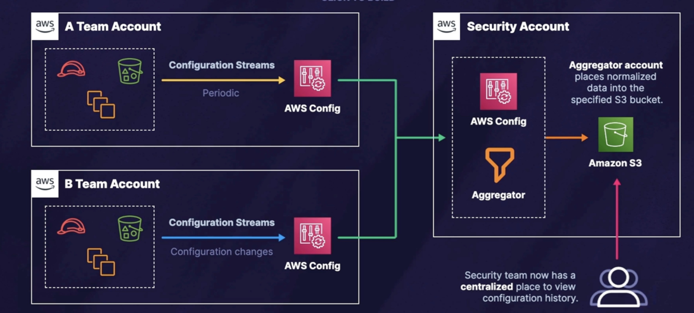

#   AWS Config
---  

---  

- Offers detailed view of  AWS resources within AWS accounts
- Provides ***historial tracking*** i.e. configuration recording timeline
- ***DOES NOT prevent*** changes
- a ***regional*** service
- SNS integration

## Usage
- Audit and Compliance, Governance
  - main usage
  - detailed autiting info for resource changes
- Resource administration
  - easily detect and notify of misconfigs
- Troubleshooting
- Security Analysis
  - view low level changes to resources

## Exam terms
- Resources
  - any entity managed by AWS
- Configuration History
- Configuration Items
  - point-in-time views of different attributes
- Configuration **Recorder**
  - must create and start a recorder before configs are stored!
- **Aggregator**
  - to aggregate views from multiple sources for multi-account, multi-region deployments 
  - requires authorization
  - can provide centralized notification
- Conformance Packs
  - Collection of Config rules & remediation actions deployed as a single entity

## Config Rules

Rules 
- Managed Rules (preset packages)
- Custom Rules (using Lambda)

Evaluation Types:
- configuration changes
- Periodic
- Compliance 
  

---  

### Multi-Account Multi-Region Data Aggregation  

---  
## AWS Resources

https://aws.amazon.com/config/

Documentation  
https://docs.aws.amazon.com/config/