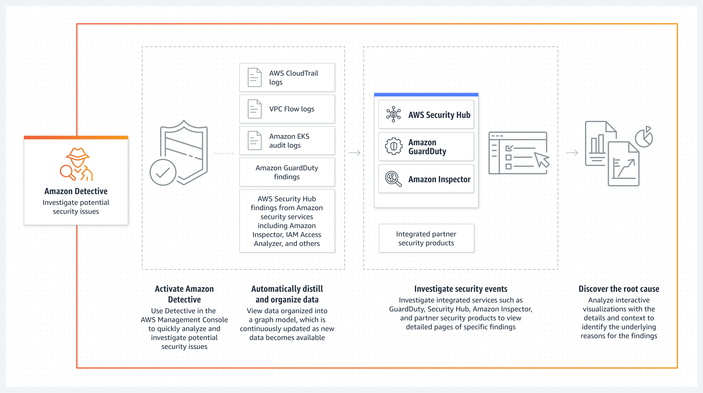
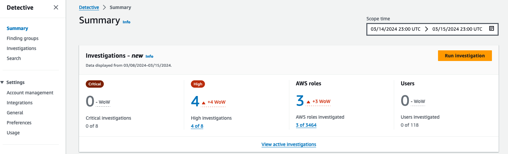
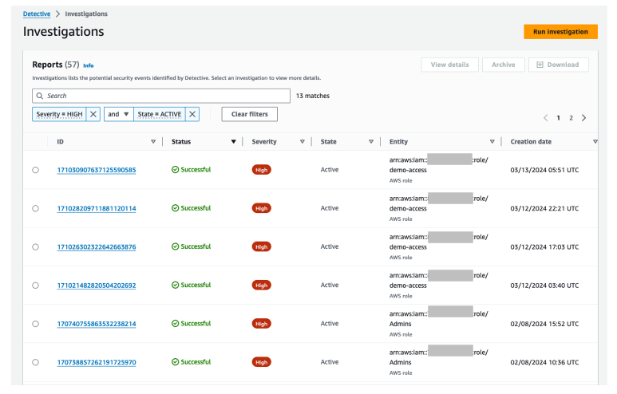

#   Amazon Detective  

---  
  

## Overview  
- Root Cause Analysis tool
- Unified view
- Triage  
- Proactive Treat Identification
  - MITRE Framework 
- Pricing 

---  
## Operations  
- Needs to be enabled  
- requires **GuardDuty**  
- Regional service
- Analyzes data from other AWS services:
  - Security Hub
  - GuardDuty
  - CloudTrail 
  - VPC flow logs
  - EKS audits

---  
## Dashboard

  

---  
## Pricing
- Based on amount of data ingested
- Tiered discounts 

---  
## AWS Resources

Features  
https://aws.amazon.com/detective/

Documentation  
https://docs.aws.amazon.com/detective/

FAQs  
https://aws.amazon.com/detective/faqs/

---  

