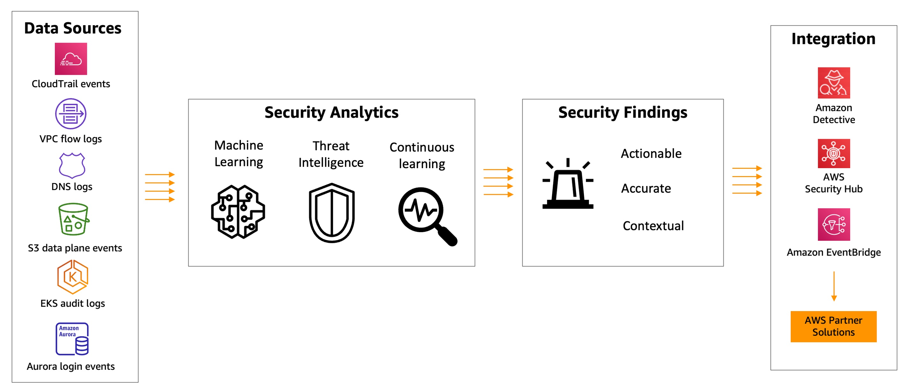
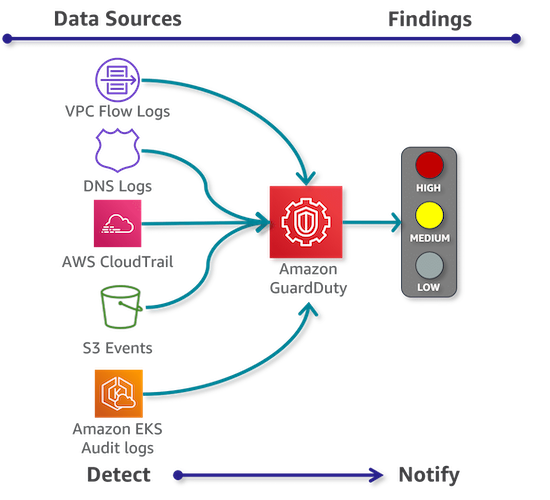
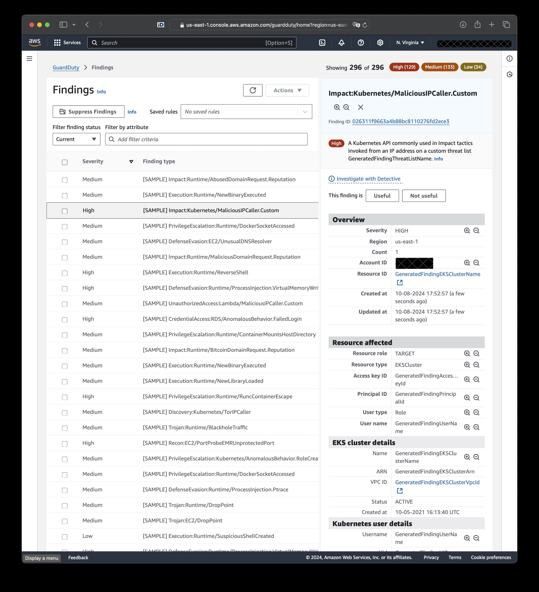

#   Amazon GuardDuty  

---  
<!--  -->

## Overview  
Managed ***Threat Detection*** service
- Detection, not prevention
- agentless 
- Regional service
  - must be enabled in each region
- Pricing based on amount of input data analyzed

<!--  -->

- ***Continuous security monitoring***  
  - for malicious or unauthorized activity
- Smart detection:
  - threat intelligence feeds
  - ML behavioral modeling

## Usage
- Aggregating and analyzing logs to identify unusual activity
- Compliance
- Automation through EvenBridge integration
- in Org: delegated admin account
  - all findings are centralized and aggregated

### Data Sources  
Using multiple **data sources**:
- AWS CloudTrail event logs
- AWS CloudTrail management events
- VPC Flow Logs (EC2 instances)
- S3 data event logs
- EKS audit logs
- DNS logs

### Findings  
Generating **findings**:
  - what happened
  - when it happened
  - what AWS resources is involved
  - who is the actor
  - EventBridge integration
    - Best-effort basis ! (not guaranteed)
- Organizations: delegated administrator account

## Integration
Optional automated response using: 
- EvenBridge
- Lambda

<!--  -->

## Use Cases
Detecting:
- Brute-Force attacks on EC2 
- Compromised EC2
- Suspicious Access Patterns
... etc.

---  
## Concepts

- Detectors  
  - unique identities  
  - regional & unique  

- Data Sources  
  - origin * location  

- Findings  
  - potential security issues  

- Suppression Rules  
  - to suppress certain findings  

- Trusted IP Lists  
  - GuardDuty will NOT generate findings from it  

- Threat Lists  
  - Known malicious IP addresses  

---  
## Exam Tips
- **Suspend** (pause) 
  - Stops all new monitoring
- **Stop** = configs are lost ! 
  - Watch out! 
  - Export before stopping if needed
- Detection only, not prevention
  - for automated remediation, use AWS Security Hub, Amazon EventBridge, AWS Lambda, and AWS Step Functions  

---  
## AWS Resources

Features  
https://aws.amazon.com/guardduty/

Documentation  
https://docs.aws.amazon.com/guardduty/

---  

