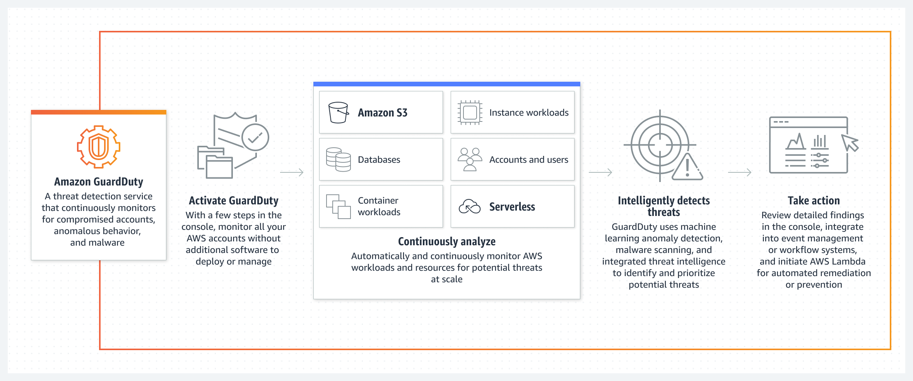

# Amazon GuardDuty    

---  

<!--  -->

---  

- Managed ***Threat Detection*** service
- Continuously monitoring for malicious or unauthorized activity
- Smart detection:
  - threat intelligence feeds
  - ML behavioral modeling
- Using multiple **data sources**:
  - AWS CloudTrail event logs
  - AWS CloudTrail management events
  - VPC Flow Logs (EC2 instances)
  - DNS logs
- Generating **findings**:
  - what happened
  - when it happened
  - what AWS resources is involved
  - who is the actor

## Usage
- Security
- Identity
- Compliance
- Automation through EvenBridge integration
- in Org: delegated admin account
  - all findings are centralized and aggregated

## Exam terms

  
---  

- Detectors
  - 

---  

