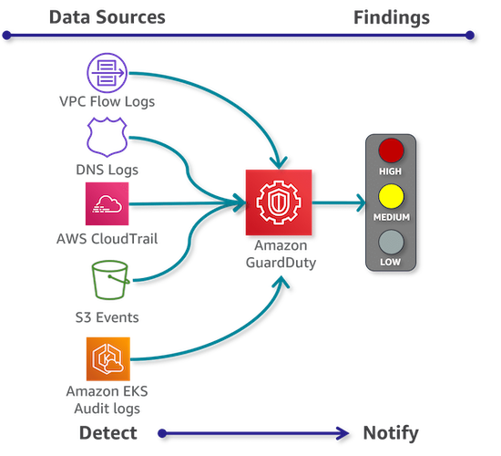

#   Amazon GuardDuty  

---  

---  
## Overview  
- Managed ***Threat Detection*** service
  - Detection, not prevention

- ***Continuous security monitoring***  
  - for malicious or unauthorized activity
- Regional service
- Smart detection:
  - threat intelligence feeds
  - ML behavioral modeling
- Using multiple **data sources**:
  - AWS CloudTrail event logs
  - AWS CloudTrail management events
  - VPC Flow Logs (EC2 instances)
  - DNS logs
- Generating **findings**:
  - what happened
  - when it happened
  - what AWS resources is involved
  - who is the actor
  - EventBridge integration
    - Best-effort basis ! (not guaranteed)
- Organizations: delegated administrator account

## Usage
- Security
- Identity
- Compliance
- Automation through EvenBridge integration
- in Org: delegated admin account
  - all findings are centralized and aggregated

Common findings:
- Brute-Force attacks on EC2 
- Compromised EC2
- Suspicious Access Patterns

---  
## Concepts

- Detectors  
  - unique identities  
  - regional & unique  

- Data Sources  
  - origin * location  

- Findings  
  - potential security issues  

- Suppression Rules  
  - to suppress certain findings  

- Trusted IP Lists  
  - GuardDuty will NOT generate findings from it  

- Threat Lists  
  - Known malicious IP addresses  

---  
## Exam Tips
- **Suspend** (pause) 
  - Stops all new monitoring
- **Stop** = configs are lost ! 
  - Watch out! 
  - Export before stopping if needed

---  
## AWS Resources

Features  
https://aws.amazon.com/guardduty/

Documentation  
https://docs.aws.amazon.com/guardduty/

---  

