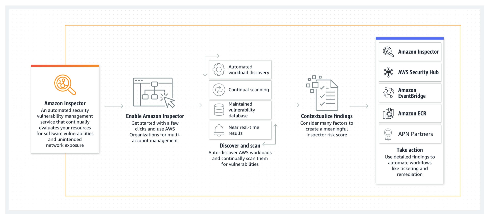

#   Amazon Inspector
---  

---  
## Overview  
- Automatic **vulnerability scans**
- Generates findings reported via lists
- Generates assessment reports

---  
## Exam topics
- Automatic discovery and scanning of eligible resources 
  - Avoid manual steps
  - EC2 instances
  - ECR images
  - LAmbda functions
- Centalized managment for OU (optional)
  - single delegated account in OU
- Findings generated with tailored scores based on NVD/CVSS

---  
## Assessment Types  
- Triggered situations for EC2 Instances  
  - New instance is launched
  - New software installed on existing EC2 instances
  - New EC2 insrtances discovered
  - New vulnerability descovered
- **Network Assessment <-- Agentless every 24hrs**
- **Host Assessment <-- SSM Agent required**  

---  
## Intergrations
- EventBridge
- Security Hub
- S3 Buckets <-- KMS key + permissions

---  
## Exported formats
- CSV 
- JSON 

---  
## Findings Status
- Active = not remediated
- Suppressed = active but ignored
- Closed = remediated

<!-- ---   -->
<!-- ## Example  -->

<!--  -->

---  
## AWS Resources  

https://aws.amazon.com/inspector/

Documentation  
https://docs.aws.amazon.com/inspector/