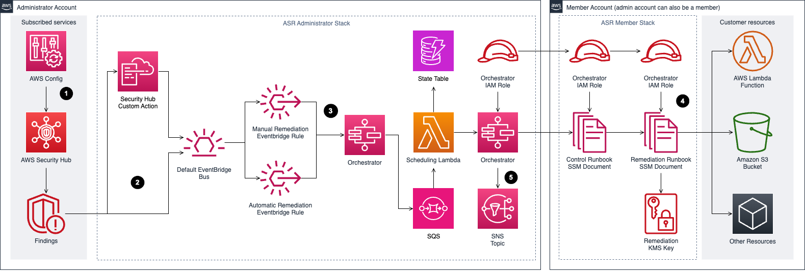
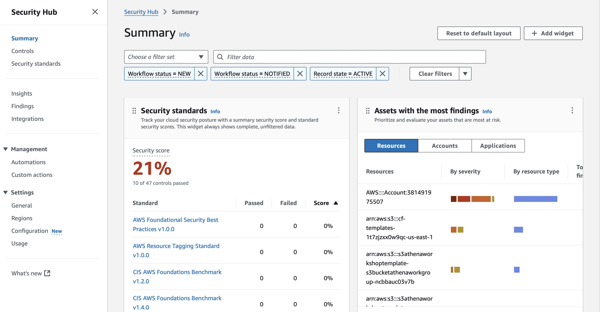
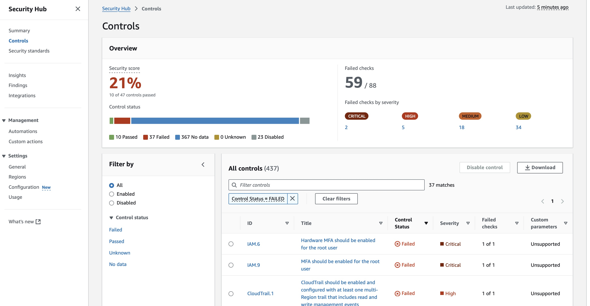
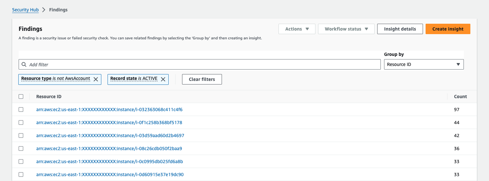
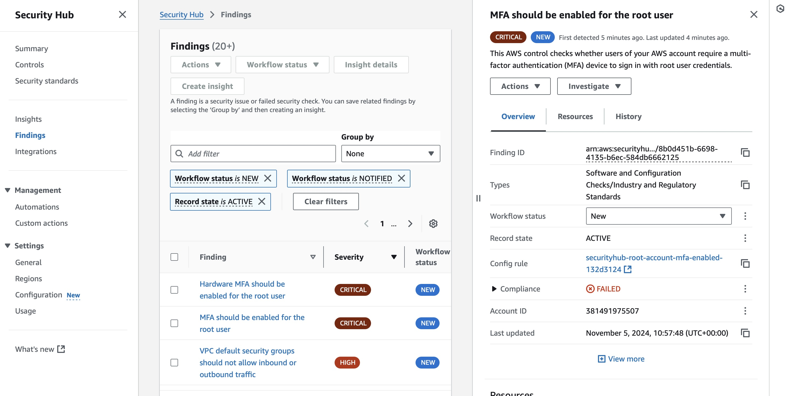
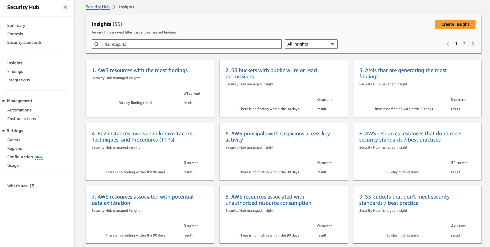
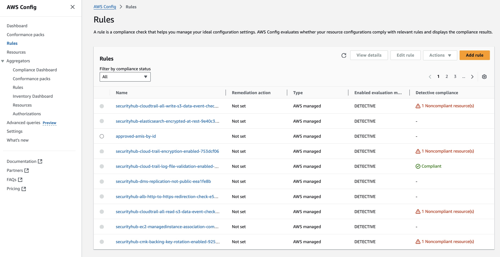

#   AWS Security Hub
---  

---  
## Overview  
- Cloud Security Posture Management (CSPM) tool
- Automated, continuous security best practice checks
- Consolidated findings across AWS accounts and partners
- AWS Config required: security checks use AWS Config managed or custom rules
- Findings in ASFF standardized data format
- Integrations for automated remediation to speed up MTTR:
  - EventBridge + Lambda
  - Step Functions 
  - AWS System Manager runbooks
  - SHARR Security Hub Automated Response and Remediation: prepackaged EventBridge rules to deploy w CFN
  - 3rd party solutions: CrowdStrike Falcon, PANW Prisma Cloud, Splunk, Snyk... 
- Regional service, but supports cross-Region aggregation of findings via designation of an aggregator Region. 

---
## Deployments
- **Single-Account** 
  - Simple
- **Multi-Account**
  - Designate an *administrator account*, to consolidate findings for all accounts
- **Cross-Region Aggregation**
  - Designate an *aggregator region* and link some or all regions to consolidate findings for all accounts

- IAM service-linked role for permissions (AWS Config... etc)  

---  
## Exam topics
- All AWS security services automatically opted in, except for Amazon Macie (sensitive data)
- Security Hub controls **require AWS Config** to be activated !
- Terms:
  - *Finding* = potential security issue (record of security check / detection)
  - *Insight* = collection of related findings (aggregation) = predefined & custom 
  - Security *Check* = evaluation of a rule against a single resource
  - Security *Control* = rule that may involve multiple resources 
  - Security *Standard* = collection of controls based on industry standards
  saved filters showing findings

---  
## Security Hub Dashboard
  

---  
## Security Hub Controls
  

---  
## Security Hub Findings
  

   

---  
## Security Hub Insights
   

---  
## Security Hub is based on AWS Config rules
   

<!-- 
---  
## Example  -->

<!-- <!--  -->

---  
## AWS Resources  

https://aws.amazon.com/security-hub/

Documentation  
https://docs.aws.amazon.com/securityhub/

FAQs  
https://aws.amazon.com/security-hub/faqs/

Workshop   
https://catalog.workshops.aws/security/en-US/0-introduction-to-threat-detection-and-response-services/security-hub/